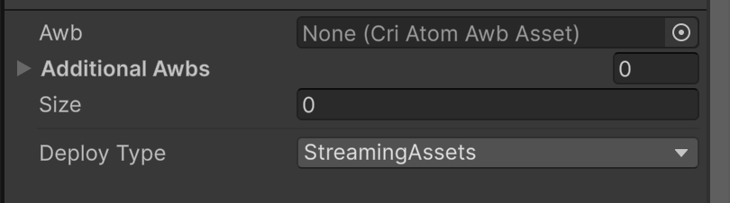
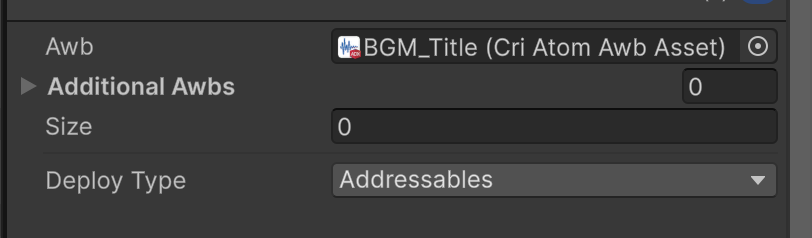
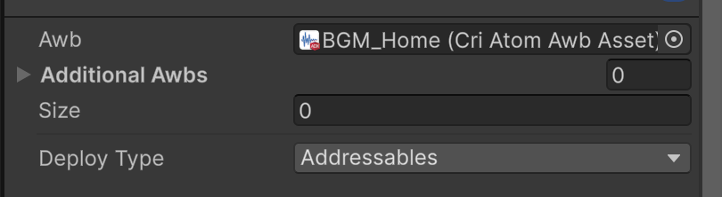
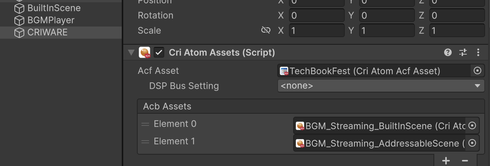
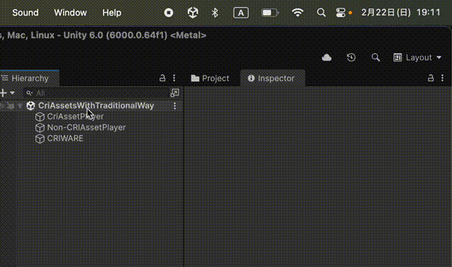

# AimingTechbook6-CRIWARE-AssetSupportAddOn

このリポジトリは Aiming Tech Book Vol.6 に掲載された `CRIWARE Asset Support Add-on の活用` の章で述べた内容を実装したサンプルプロジェクトです。本誌を読みながらプロジェクトを参照することで、機能の実装例や利用例を確認できます。

本リポジトリでは以降、 CRIWARE Asset Support Add-on を **アドオン** と表記します。

## 動作環境・使用ライブラリ

名前|バージョン
-|-
Unity | 6000.0.64f1
ADX LE Unity SDK | 3.12.01
CRI Assets | 1.3.04
CRI Addressables | 0.10.02
UniTask | 2.5.10

### サンプルに含まれる音声について

以下のサイトの音声を利用しています。

* 効果音 : [魔王魂](https://maou.audio/)
* BGM : [BGMer](https://bgmer.net/)

## サンプルシーンについて

### CriAssetsPlayTest

アドオンの機能を使って音を鳴らす最小限のシーンです。シーンを開始すると効果音が鳴ります。

### CriAssetsWithTraditionalWay

StreamingAssets 以下に配置した Non-CRI アセットデータと、それ以外の場所に配置した CRI アセットを扱うシーンです。

シーンを開始するとそれぞれ CriAtomSource と CriAtomSourceForAsset で再生します。

### AddressablesTypeSample

CRI アセットの DeployType を Addressables にして AssetGroup で扱うサンプルです。Title シーンがビルトインシーン、 Home シーンが Addressables によりバンドル化されたシーンです。

* Title シーンでは GUID と文字列を使ってキューを指定しています。
  * `SE_Generic.acb` や `TechBookFest.acf` はビルトインシーンで参照するので、 DeployType を StreamingAssets にしています。
  * BGM_Title は文字列を使ってキューを指定しています。これはビルトインシーンに参照関係が生まれないため DeployType を Addressables にしています。
* Home シーンでは GUID を使って DeployType を Addressables にした CRI アセットから音声を再生します。

SE_Generic.acb|BGM_Title.acb|BGM_Home.acb
-|-|-
||

### StreamingAssetsTypeSample

CRI アセットの DeployType を StreamingAssets にして扱うサンプルです。 BuiltInScene シーンがビルトインシーン、 AddressableScene シーンが Addressables によりバンドル化されたシーンです。

BuiltInScene には AddressableScene でのみ再生する `BGM_Streaming_AddressableScene.acb` を参照しています。ビルトインシーンで参照することでビルド時 StreamingAssets に実データを配置します。

## ユーティリティについて

アドオン導入や、アドオン適用後のデータ更新をスムーズに行うための機能群です。

### SoundComponentReplacer

CriAtomSource や CriAtomClip から CriAtomSourceForAsset や CriAtomAssetClip に置き換える機能です。

* "オブジェクト内の Source をアセット参照式に置き換え" : GameObject にアタッチされた CriAtomSource を CriAtomSourceForAsset に変換します

* "タイムラインの Source をアセット参照式に置き換え" : PlayableDirector がアタッチされた GameObject を選択して実行すると、 PlayableDirector の Binding に設定された CriAtomSource を CriAtomSourceForAsset に変換します

* "タイムラインの Clip をアセット参照式に置き換え" : Timeline アセットを選択して実行すると CriAtomTrack 内のクリップを CriAtomClip から CriAtomAssetClip に置き換えます

### SoundAssetsImportWindow

CriAtomCraft が出力したデータを Unity にインポートする機能です。同名のファイルがあった場合、 meta ファイルはそのままに CRI アセットのみを更新します。

ドラッグ&ドロップで Unity にインポートすると、同名のファイルがある場合に新しく CRI アセットと meta ファイルが作られてしまいます。本機能を通してインポートすることでこれを防げます。

#### 使い方

1. メニューから Sound > CRI ファイルのインポートツール を選択
2. インポート先のフォルダを選択
3. インポートしたいファイルが入ったフォルダを選択
4. インポートするファイルにチェックをつけてインポートボタンを押す

https://github.com/user-attachments/assets/42a0bc12-ae98-43a6-8acd-cf72b56e45e8

# <video src="images/utility_sound_asset_importer_window.mov" width="80%" controls muted loop>お使いのブラウザは video タグをサポートしていません。</video>
